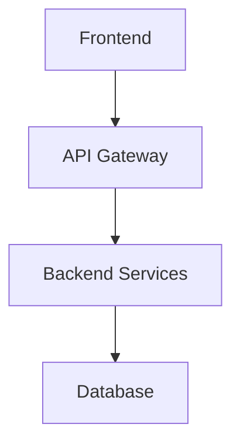

# Best Practices for Writing a Clear and Effective Project README


## Table of Contents
1. [Project Overview](#project-overview)
2. [Installation](#installation)
3. [Usage](#usage)
4. [Contributing](#contributing)
5. [Visual Elements](#visual-elements)
6. [Architecture](#architecture)
7. [Deployment](#deployment)
8. [Security](#security)
9. [Performance](#performance)
10. [Licensing](#licensing)
11. [Tips for Effective READMEs](#tips-for-effective-readmes)

## Project Overview
A well-structured README is essential for any project. Here are the key elements to include:


<svg width="200" height="60" viewBox="0 0 200 60" style="position: relative; width: 100%; left: 0; margin: 20px 0;">
  <rect x="10" y="10" width="180" height="40" rx="5" fill="#4CAF50" opacity="0.8"/>
  <text x="100" y="35" font-family="Arial" font-size="16" fill="white" text-anchor="middle">Project Overview</text>
</svg>

- Clear project title
- Brief description
- Key features
- Technologies used
- Project status

## Installation
Provide clear installation steps:

```bash
# Example installation steps
git clone <repository-url>
cd project-name
npm install
```

<div style="position: relative; width: 100%; left: 0; margin: 20px 0;">
<svg width="200" height="60" viewBox="0 0 200 60" style="display: block;">
  <rect x="10" y="10" width="180" height="40" rx="5" fill="#2196F3" opacity="0.8"/>
  <text x="100" y="35" font-family="Arial" font-size="16" fill="white" text-anchor="middle">Installation Guide</text>
</svg>
</div>

## Usage
Include:
- Basic usage examples
- Configuration options
- Common commands
- Screenshots or demos

## Contributing
Explain how others can contribute:

<div style="position: relative; width: 100%; left: 0; margin: 20px 0;">
<svg width="200" height="100" viewBox="0 0 200 100" style="display: block;">
  <circle cx="50" cy="50" r="30" fill="#FFC107" opacity="0.8"/>
  <circle cx="100" cy="50" r="30" fill="#FF5722" opacity="0.8"/>
  <circle cx="150" cy="50" r="30" fill="#9C27B0" opacity="0.8"/>
  <text x="100" y="90" font-family="Arial" font-size="14" fill="#333" text-anchor="middle">Contribution Flow</text>
</svg>
</div>

1. Fork the repository
2. Create a feature branch
3. Make changes
4. Submit a pull request

## Visual Elements
Enhance your README with visual elements:

### Project Status Badge
<div style="position: relative; width: 100%; left: 0; margin: 20px 0;">
<svg width="150" height="40" viewBox="0 0 150 40" style="display: block;">
  <rect x="5" y="5" width="140" height="30" rx="15" fill="#4CAF50"/>
  <text x="75" y="25" font-family="Arial" font-size="14" fill="white" text-anchor="middle">Active</text>
</svg>
</div>

### Version Badge
<div style="position: relative; width: 100%; left: 0; margin: 20px 0;">
<svg width="150" height="40" viewBox="0 0 150 40" style="display: block;">
  <rect x="5" y="5" width="140" height="30" rx="15" fill="#2196F3"/>
  <text x="75" y="25" font-family="Arial" font-size="14" fill="white" text-anchor="middle">v1.0.0</text>
</svg>
</div>

## Architecture
Document your project's architecture:

### System Components


### Technology Stack
- Frontend: React/Vue/Angular
- Backend: Node.js/Python/Java
- Database: PostgreSQL/MongoDB
- Cache: Redis
- Message Queue: RabbitMQ

## Deployment
Provide deployment information:

### Prerequisites
- Docker v20+
- Kubernetes v1.20+
- Cloud provider account

### Deployment Steps
```bash
# Build Docker image
docker build -t myapp .

# Deploy to Kubernetes
kubectl apply -f k8s/
```

### Environment Variables
```env
API_KEY=your_api_key
DB_CONNECTION=database_url
CACHE_TTL=3600
```

## Security
Document security considerations:

### Authentication
- JWT token-based authentication
- OAuth2 integration
- Rate limiting

### Data Protection
- Data encryption at rest
- SSL/TLS configuration
- Regular security audits

### Compliance
- GDPR compliance
- HIPAA compliance (if applicable)
- SOC2 certification

## Performance
Include performance metrics and optimization guidelines:

### Benchmarks
- Response time: < 200ms
- Throughput: 1000 req/sec
- Error rate: < 0.1%

### Monitoring
- APM integration
- Resource utilization
- Error tracking

### Optimization Tips
- Enable caching
- Use CDN for static assets
- Implement database indexing

## Tips for Effective READMEs
- Keep it concise but informative
- Use clear headings and sections
- Include relevant links
- Keep documentation up-to-date
- Add visual elements for better engagement
- Regularly update benchmarks and metrics
- Include troubleshooting guides
- Document breaking changes
- Maintain a changelog
- Provide support contacts

## Licensing
Choosing the right license is crucial for your project. Here's a guide to common licenses:

### Popular Open Source Licenses

#### MIT License
- Most permissive and popular
- Allows commercial use, modification, distribution
- Minimal restrictions
- Best for: Libraries, frameworks, and projects wanting maximum adoption

#### Apache License 2.0
- Similar to MIT but with patent protection
- Includes explicit grant of patent rights
- Best for: Enterprise-level projects, especially those with patent concerns

#### GNU General Public License (GPL)
- Ensures derivative works remain open source
- Requires source code disclosure
- Versions: GPLv2, GPLv3
- Best for: Projects prioritizing software freedom and open source principles

#### BSD Licenses
- Similar to MIT but with variations
- Different versions (2-Clause, 3-Clause)
- Best for: Academic projects and basic open source software

### How to Choose
1. Consider your project goals
2. Evaluate commercial implications
3. Check compatibility with dependencies
4. Review company policies (if applicable)

### License Implementation
1. Add LICENSE file to root directory
2. Include license notice in source files
3. Document license in README
4. Update package metadata