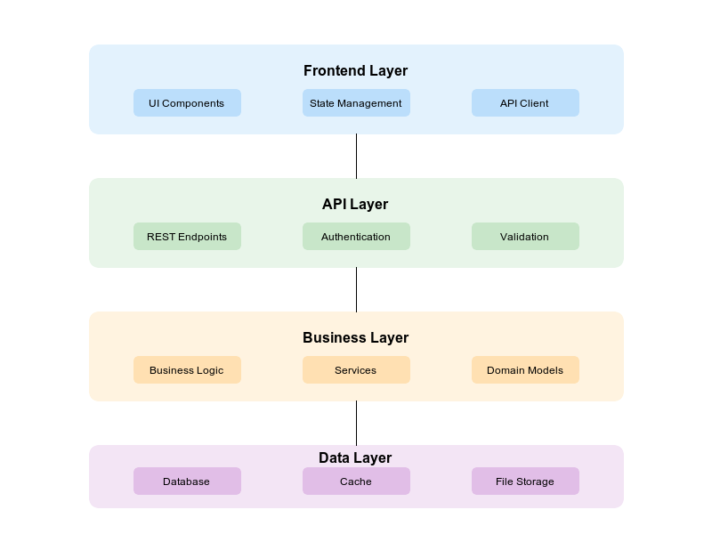
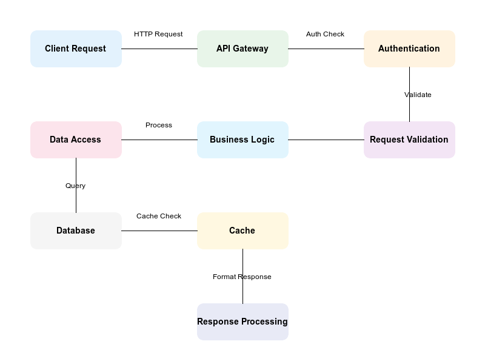
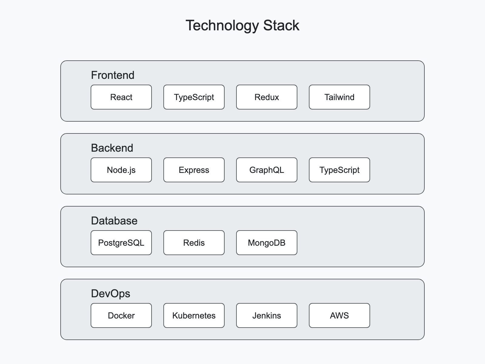

# Best Practices for Project Documentation

*A comprehensive guide to documenting projects effectively for technical evaluation and contribution*


## Table of Contents
1. [Executive Summary](#executive-summary)
2. [Technical Architecture](#technical-architecture)
3. [Development Practices](#development-practices)
4. [Project Evaluation Guide](#project-evaluation-guide)
5. [Contribution Framework](#contribution-framework)

## Executive Summary
> For a quick project overview, please refer to our README.md(include Readme path)

### For Technical Evaluators
- **Technical Complexity Assessment**
  - Architecture decisions and trade-offs
  - Scalability considerations
  - Performance optimizations
  - Security implementations

- **Code Quality Indicators**
  - Testing coverage metrics
  - Code review practices
  - Documentation standards
  - CI/CD implementation

### For Contributors
- **Technical Prerequisites**
  - Required expertise level
  - Development environment setup
  - Recommended tools and extensions

- **Getting Started Guide**
  - First contribution walkthrough
  - Common pitfalls to avoid
  - Mentorship opportunities

## Technical Architecture

### System Overview


### Data Flow


### Technology Stack


### Key Technical Decisions
- **Architecture Patterns**
  - Why we chose specific patterns
  - Trade-offs considered
  - Future scalability plans

- **Database Design**
  - Schema overview
  - Indexing strategy
  - Query optimization

- **API Design**
  - RESTful principles
  - Authentication flow
  - Rate limiting strategy

## Development Practices

### Code Organization
```
project/
├── src/
│   ├── core/
│   ├── api/
│   └── utils/
├── tests/
└── docs/
```

### Quality Assurance
- **Testing Strategy**
  - Unit testing approach
  - Integration testing
  - E2E testing framework
  - Performance testing

- **Code Review Process**
  - PR template usage
  - Review checklist
  - Automated checks

### Performance Optimization
- **Frontend Performance**
  - Bundle size optimization
  - Lazy loading implementation
  - Caching strategy

- **Backend Performance**
  - Database optimization
  - API response time
  - Resource utilization

## Project Evaluation Guide

### For Technical Recruiters

#### Key Assessment Areas
1. **Technical Complexity**
   - System design considerations
   - Implementation challenges
   - Problem-solving approaches

2. **Code Quality**
   - Architecture patterns
   - Testing practices
   - Documentation quality

3. **Project Management**
   - Issue tracking
   - Release management
   - Team collaboration

#### Technical Deep Dive Areas
- Authentication implementation
- Data modeling approach
- API design patterns
- Performance optimization techniques

### Success Metrics
- Code coverage percentage
- API response times
- Bug resolution time
- Documentation completeness

## Contribution Framework

### Getting Started
> For basic setup instructions, please refer to our [README.md](http://localhost:3002/proSamik/Blog-notes/blob/main/Best-Practices-for-project-readme.md)

### Advanced Setup
1. **Development Environment**
   - IDE configuration
   - Debug setup
   - Testing environment

2. **Local Development**
   - Hot reload setup
   - Mock data generation
   - API documentation

### Best Practices
- **Code Style**
  - Naming conventions
  - File organization
  - Comment guidelines

- **Git Workflow**
  - Branch naming
  - Commit messages
  - PR process

### Documentation Requirements
- API documentation
- Test coverage reports
- Performance benchmarks

## Maintenance and Support

### Version Control
- Semantic versioning
- Change log maintenance
- Deprecation policies

### Issue Management
- Bug reporting template
- Feature request process
- Priority classification

### Support Channels
- Technical discussion forums
- Code review platforms
- Community chat channels

## Future Roadmap

### Planned Features
- Short-term goals (1-3 months)
- Mid-term goals (3-6 months)
- Long-term vision

### Technical Debt
- Known limitations
- Improvement areas
- Refactoring plans

---

*Note: This document is maintained alongside our [README.md] and focuses on detailed technical aspects and contribution guidelines. For basic project information and setup, please refer to the README.*
