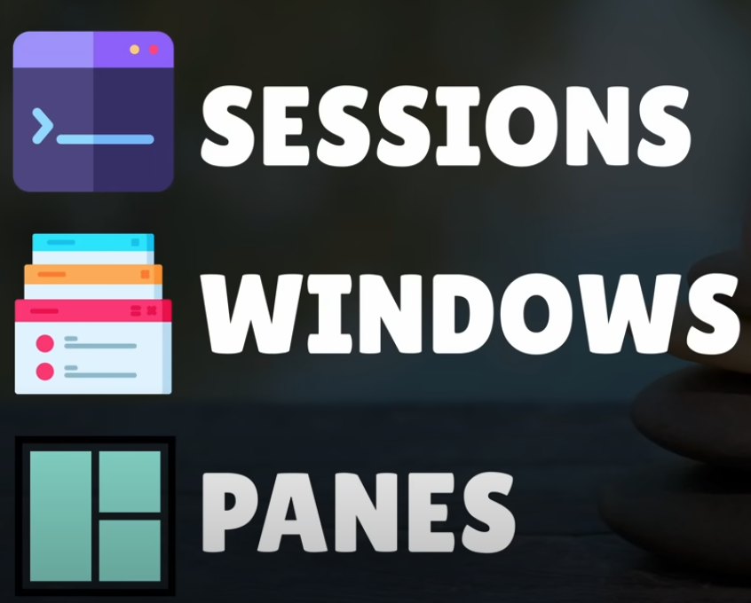
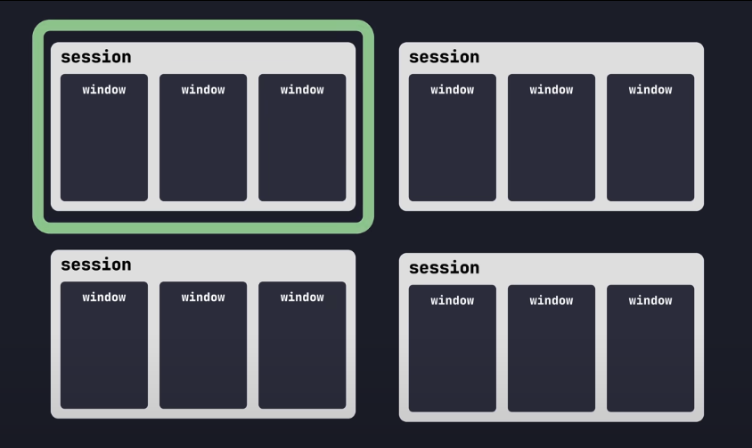
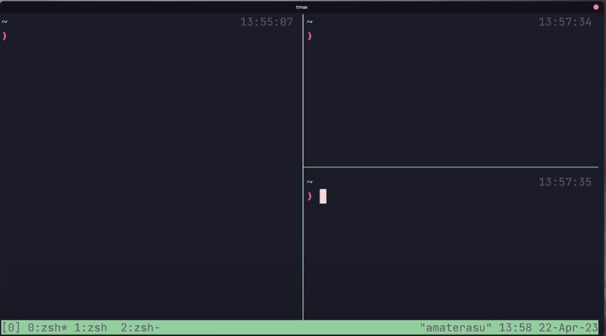
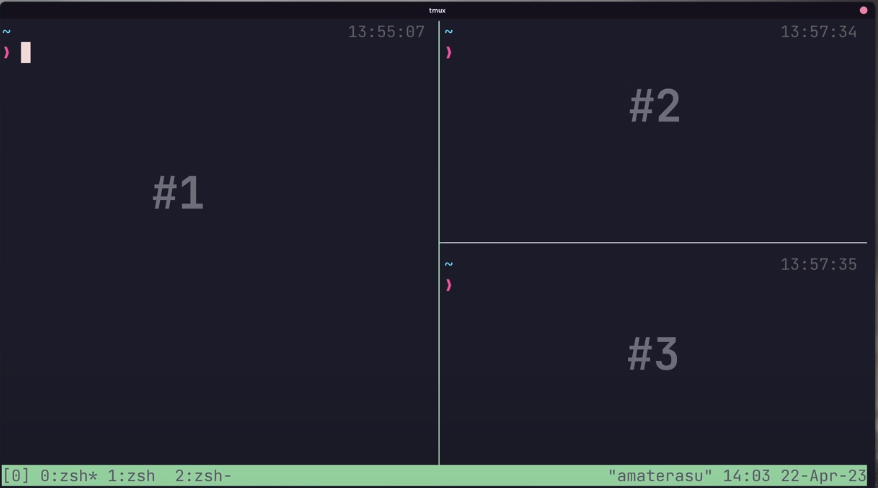
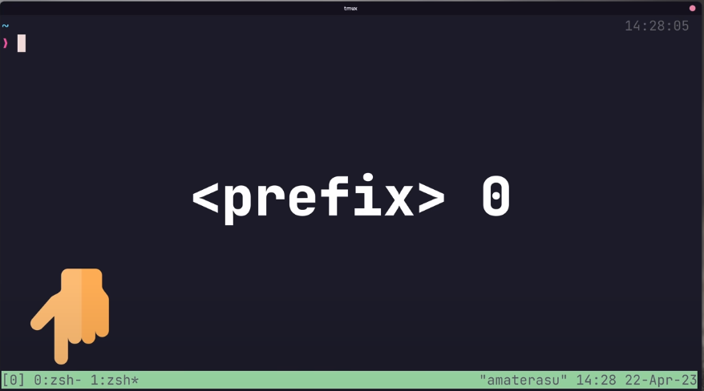

# Productive Tmux Setup you should have

## Step 1: Install Tmux

Next, I installed [tmux](https://github.com/tmux/tmux), a terminal multiplexer that allows for multiple sessions and panes. Here are some beginner-friendly commands I found useful:

- `tmux list-sessions` – List all current sessions.
- `tmux new-session -s <name>` – Create a new session.
- `tmux attach-session -t <name>` – Attach to an existing session.
- `tmux kill-session -t <name>` – Kill a specific session.

Using tmux helps in managing multiple tasks in a single terminal window, which significantly improves productivity.


## Step 2: Understand Tmux

Tmux has three objects-



- Session
  - They are the top most layer in Tmux.
  - Collection of one or more windows managed in one unit.
  - You can have multiple sessions but only attached to one.
  - Each session has only one active window
  
- Windows
  - They are containers to one or more panes.
  - Windows in the session are shown in the bottom of the application 
  - The active window will have asterisk(*) attached to its name
  - 
- Panes
  - They are splits in the window
  - 


## Step 3: How to use Tmux

To enter commands in the Tmux, you need to use Prefix Key and the default is `ctrl + b`

Use this [config file](https://github.com/dreamsofcode-io/tmux/blob/main/tmux.conf)

Follow these instructions to load the config file and install the required plugins-
```bash
 nano ~/.tmux.conf  
 tmux
 tmux source ~/.tmux.conf 
 ~/.tmux/plugins/tpm/bin/install_plugins  
```

Current prefix changed to `C-Space` = `ctrl + space`

### 🔑 How to Use it in Tmux:
    - Hold the Ctrl key.
    - Press the Spacebar.
    - Release both keys.

## Step 4: The Most Used Commands

### Windows and Pane
- Create a new window and set it active: `<prefix> + c` 
- Switch windows: `<prefix> + 0` 
- 
- Cycle windows: `<prefix> + n` or `<prefix> + p` (next or prev.)
- Swap Windows: `<prefix> + : 'swap-window -s 2 -t 1'`
- Kill All windows: `<prefix> + &`
- Split Current Pane Horizontally: `<prefix> + %`
- Split Current Pane Vertically: `<prefix> + "`
- Panes can be navigated: `<prefix> + ↑/↓/←/→` (arrow keys)
- Swap current pane: `<prefix> + }/{`
- Switch Pane using number: `<prefix> + q + (desired number)` 
- Full window and vice versa: `<prefix> + z`
- Pane into a window: `<prefix> + !`
- Kill pane: `<prefix> + x`

### Session
  
- Create new session while not attached to a current session: `tmux`
- Create new session with a name: `tmux new -s <session-name>`
- Attach to last session: `tmux a`
- Attach to target session: `tmux a -t <session-name>`
- If inside tmux, new session: `<prefix> : new`
- When outside, list session: `tmux ls`
- When inside, list session: `<prefix> s`
- When inside, preview windows: `<prefix> w`

The above covers the basic and most used commands, for more refer this [cheat sheet](https://tmuxcheatsheet.com/)

### Copy Code (after using the conf file)

- Enter copy mode: `<prefix> + [`
- move like vim using: `h j k l for left, up, down, right`
- select from where you would like to copy: `v`
- press- `y` to yank up the selection 
- Toggle line select or rectangle select- `ctrl + V`


Moment of truth, it is inspired from [DreamsOfCode](https://www.youtube.com/@dreamsofcode)