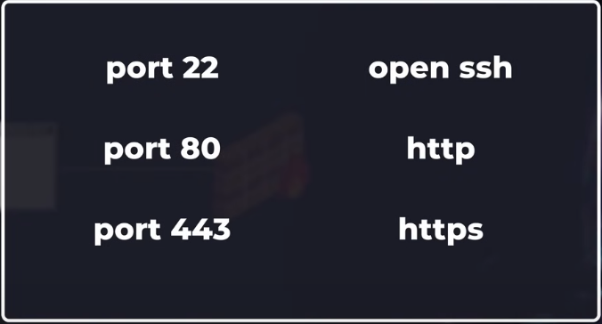

# Production-Ready VPS Setup: A Practical Checklist

Production Ready Requirements

1. Domain Name
2. App running
3. TLS + HTTPS + AUTO RENEW
4. OPEN SSH Hardening
5. Firewall
6. Load Balancer + AIA ()
7. Automated Deployment (while keeping the service available) (watchtower)
8. Monitoring (uptimeRobot)


VPS-
1. Remove password authentication (SSH hardening)
2. Use Tmux (Session won't drop)


Firewall, use ufw- 



Look later-

If you have a VPS (Virtual Private Server), you'll typically need several key components to set up a robust production environment. Let me break it down based on core requirements:

1. Configuration Management:
- Ansible is often the best choice for VPS management because:
  ```yaml
  # Example Ansible playbook
  - name: Configure web server
    hosts: webserver
    tasks:
      - name: Install Nginx
        apt:
          name: nginx
          state: present
  ```
  This helps automate server setup, software installation, and configuration updates.

2. Monitoring & Logging:
- Prometheus + Grafana for metrics monitoring
- ELK Stack (Elasticsearch, Logstash, Kibana) or Loki for log management
- Node Exporter for server metrics

3. Security Essentials:
```bash
# Basic security setup
- UFW (Uncomplicated Firewall)
- Fail2ban for intrusion prevention
- SSL/TLS certificates (Let's Encrypt)
```

4. CI/CD Pipeline:
- Jenkins, GitLab CI, or GitHub Actions for automated deployments
- Docker for containerization
```yaml
# Example Docker Compose setup
version: '3'
services:
  app:
    build: .
    ports:
      - "3000:3000"
```

5. Backup Solution:
- Regular backups using tools like Restic or Borg
- Off-site backup storage

6. Load Balancer (if running multiple services):
- Nginx or HAProxy for request distribution
- SSL termination

7. Process Manager:
```javascript
// PM2 config example (since you're working with JavaScript)
module.exports = {
  apps: [{
    name: "my-app",
    script: "app.js",
    instances: "max",
    exec_mode: "cluster"
  }]
}
```

8. Database Management:
- Database backup scripts
- Connection pooling
- Replication setup if needed
