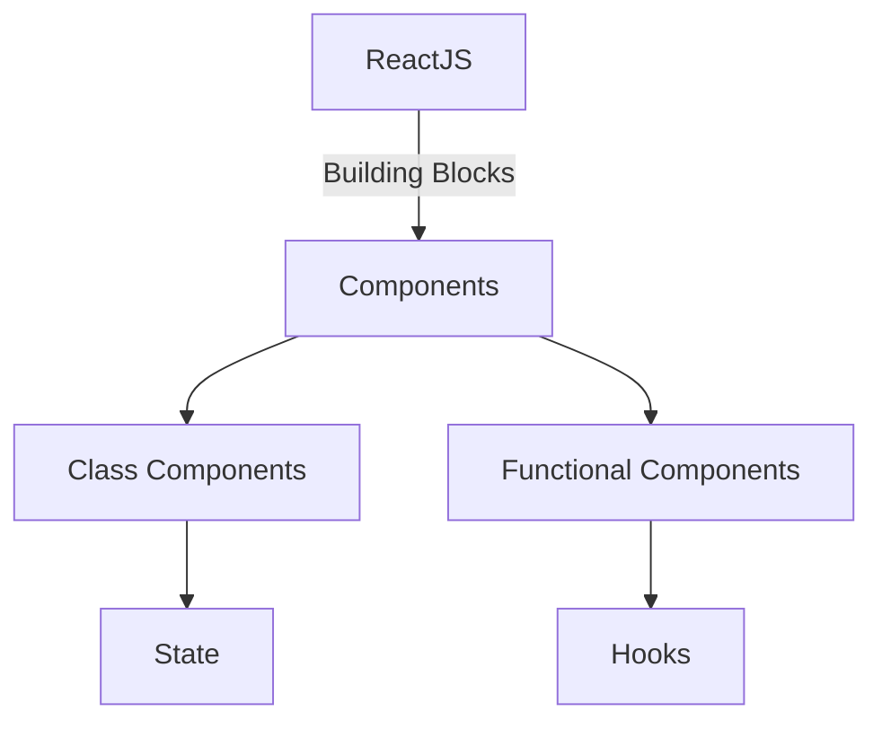

# How to write the README that [prosamik](https://www.prosamik.com) can understand [[README template]](https://github.com/proSamik/demo-template/edit/main/README.md)

### Content shows the rendered template from this [repo](https://github.com/proSamik/demo-template/edit/main/README.md)
---

## Table of Contents
1. [Introduction](#introduction)
2. [Key Points](#key-points)
3. [Code Examples](#code-examples)
4. [Lists and Points](#lists-and-points)
5. [Media Elements](#media-elements)
6. [Interactive Features](#interactive-features)
7. [Most Important- Github Badges](#github-badges)
8. [Conclusion](#conclusion)

---

## Introduction
Welcome to this blog post where we explore various **Markdown elements**.  
Here's a quick example of text formatting:  
- **Bold**
- *Italic*
- ~~Strikethrough~~
- ***Combined formatting***
- <u>Underlined</u>

---

## Key Points

> **Key Takeaway:** Markdown helps you structure content effectively.  

💡 **Tip:** Use formatting sparingly to avoid cluttered text.

---

## Code Examples

### Inline Code
Use `inline code` for small snippets.

### Code Block
```javascript
// Example: JavaScript Function
function greet(name) {
    return `Hello, ${name}!`;
}
```

### Bash Code with Copy
```bash
# Install dependencies
npm install
```

---

## Lists and Points

### Unordered List
- Point 1
- Point 2
  - Sub-point 2.1
  - Sub-point 2.2

### Ordered List
1. Step 1
2. Step 2
   1. Sub-step 2.1
   2. Sub-step 2.2

---

## Media Elements
(All will be centered aligned)

### Image


### Image with fix width and height
(Use inline HTML for that)
<p></p>


### SVG Example
```html
<svg width="100" height="100">
  <circle cx="50" cy="50" r="40" stroke="black" stroke-width="3" fill="red" />
</svg>
```

### Mermaid js code-



### GIF


Video Example- 
https://youtu.be/cn8MsmLzOQQ

---

## Tables
| Column 1   | Column 2   | Column 3   | Column 4   | Column 5   | Column 6   | Column 7   | Column 8   | Column 9   | Column 10  |
|------------|------------|------------|------------|------------|------------|------------|------------|------------|------------|
| Data 1     | Data 2     | Data 3     | Data 4     | Data 5     | Data 6     | Data 7     | Data 8     | Data 9     | Data 10    |
| Data A     | Data B     | Data C     | Data D     | Data E     | Data F     | Data G     | Data H     | Data I     | Data J     |
| Data AA    | Data BB    | Data CC    | Data DD    | Data EE    | Data FF    | Data GG    | Data HH    | Data II    | Data JJ    |
| Data AAA   | Data BBB   | Data CCC   | Data DDD   | Data EEE   | Data FFF   | Data GGG   | Data HHH   | Data III   | Data JJJ   |
| Data 1A    | Data 2B    | Data 3C    | Data 4D    | Data 5E    | Data 6F    | Data 7G    | Data 8H    | Data 9I    | Data 10J   |
| Data 1B    | Data 2C    | Data 3D    | Data 4E    | Data 5F    | Data 6G    | Data 7H    | Data 8I    | Data 9J    | Data 10K   |
| Data 1C    | Data 2D    | Data 3E    | Data 4F    | Data 5G    | Data 6H    | Data 7I    | Data 8J    | Data 9K    | Data 10L   |
| Data 1D    | Data 2E    | Data 3F    | Data 4G    | Data 5H    | Data 6I    | Data 7J    | Data 8K    | Data 9L    | Data 10M   |
| Data 1E    | Data 2F    | Data 3G    | Data 4H    | Data 5I    | Data 6J    | Data 7K    | Data 8L    | Data 9M    | Data 10N   |
| Data 1F    | Data 2G    | Data 3H    | Data 4I    | Data 5J    | Data 6K    | Data 7L    | Data 8M    | Data 9N    | Data 10O   |

---

## Interactive Features

### Footnotes
Here is an example of a footnote- Important tip[^1].

Example of second footnote- Benefit[^2].

Example of third footnote- Our benefit[^3].

[^1]: Github uses GitHub Flavoured Markdown.
[^2]: It supports inline HTML.
[^3]: We can give the style we want but it will not understand.

### Blockquote
> This is a **blockquote** example to highlight content.

### Spoiler/Expandable Section
<details>
  <summary>Click to expand!</summary>
  Hidden content revealed!
</details>

### Mathematical Equation
The famous equation:  
\[ E = mc^2 \]

### Progress Bar
`[■■■■■□□□□□] 50% Complete`

---
## GitHub Badges
I know you love some visual elements and that is also covered here:

### - Use directly 
(Center aligned automatically in prosamik as it is treated as images)


### - Appear in different lines
(again, centre-aligned in prosamik as each one as treated as single entity)

 
 
 

### - Appear in the same line
 (use inline HTML which Github Flavoured Markdown understands and using style which prosamik understands)
 
<div style="display: flex; width: 100%; align-items: center;">
    <a href="https://linkedin.com/in/proSamik"></a>
    <a href="https://linkedin.com/in/proSamik"></a>
    <a href="https://linkedin.com/in/proSamik" style="margin-left: auto;"></a>
</div>

### - Same line but few left and right-aligned
 (give align="right" to img tag)
 Note: (use inline HTML which Github Flavoured Markdown understands and using style which prosamik understands)
<div style="display: flex; width: 100%; align-items: center;">
    <a href="https://linkedin.com/in/proSamik"></a>
    <a href="https://linkedin.com/in/proSamik"></a>
    <a href="https://github.com/prosamik" style="margin-left: auto;"></a><a href="https://linkedin.com/in/proSamik"></a>
</div>

---

## Conclusion
Thanks for reading this blog! Please share your thoughts below.  

